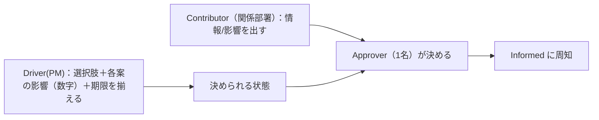

# 統合ツール：責任分担（RACI ＋ DACI）

> 統合元：PMBOK 10.2 RACI ＋ 内製教科書 第29章（RACI／DACI／会議体）。
> **残した中心**：RACIはPMBOKの表をそのまま。加えて教科書のDACI（決める人と決められる状態を作る人の分離）と「埋まらないマスが問題所在」を採用。

## 1. RACI（作業・成果物にプロジェクト全体で1枚）

R=実行 / **A=説明責任（1タスク原則1名）** / C=協業（双方向）/ I=報告先（一方向）

| タスク | PM | 開発リード | QA | スポンサー | 利用者代表 |
|--------|----|-----------|----|-----------|-----------|
| 要件定義の確定 | A | C | C | I | R |
| スケジュール承認 | R | C | I | A | I |
| 品質基準（DoD）合意 | A | R | R | I | C |
| リリース判断 | C | C | C | A | I |

**点検**：各行でAが必ず1つか。**Aが決まらないマスが、そのプロジェクトの問題の所在**（教科書：売上計上先でネット部長も店舗本部長もAと言わない→上位に置くと露見する）。

## 2. DACI（一つの意思決定に、決まるまでの間だけ）

| 役割 | 誰 | すること |
|------|----|---------|
| **Driver** | PM | 選択肢を整理し、各案の影響を数字で示し、決裁の場に載せる |
| **Approver** | 1名 | どの案にするかを決める |
| Contributor | 関係部署 | 情報・意見・自部門への影響を出す |
| Informed | 影響を受ける人 | 決定と、その運用上の意味を知る |

> **要点**：Approver（決める人）と Driver（決められる状態を作る人）は別。
> 「決めてくれない」の大半は、Driverの仕事（選択肢＋得失＋期限を揃える）が終わっていないだけ。

> 「社長が決めてくれない」＝Driverの仕事が終わっていない（白紙で持ち込んでいる）。

## 3. 使い分け
- **RACI**＝開始時に1枚（責任分界の合意と抜けの発見）。憲章に添える。
- **DACI**＝判断が詰まったときに1行（止まった判断を動かす）。
- 兼任してよいが「今どの帽子で話しているか」を明示し、判断が一人の中で閉じないようにする（教科書 第4章）。
