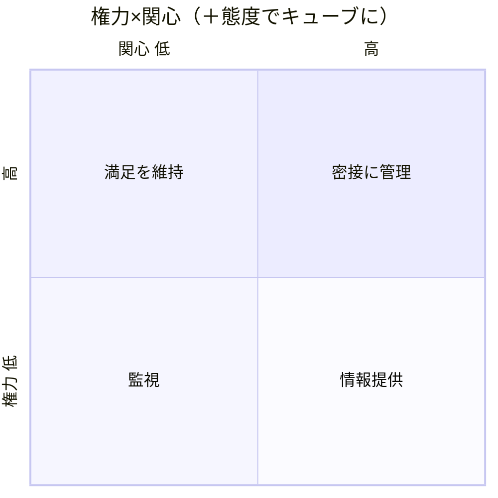

# 統合ツール：ステークホルダー分析（グリッド ＋ 態度キューブ）

> 統合元：PMBOK 10.4 パワー×関心グリッド ＋ 内製教科書 第31章（キューブ）。
> **残した中心**：PMBOKの2次元グリッドに、教科書の「態度（賛成/反対/不明）」の第3軸を足したキューブ。

## 1. パワー×関心グリッド（PMBOK）

```
              関心：低い          関心：高い
影響力：高い   ①満足を維持        ②密接に管理（最重要）
影響力：低い   ③モニターする      ④情報提供を続ける
```

## 2. ＋態度の軸＝キューブ（教科書：関与の“戦略”が変わる）


> ＋態度（賛成/反対/不明）。★最危険＝権力高・関心低・態度[不明]→「まず態度を確かめる」。放置すると受入テスト直前に「聞いていない」。


| 権力 | 関心 | 態度 | 2次元での扱い | 3次元で変わること |
|---|---|---|---|---|
| 高 | 高 | 賛成 | 密接に管理 | 判断を委ねる・共同意思決定者 |
| 高 | 高 | 反対 | 密接に管理 | 懸念を先に潰す・合意点を切り出す |
| 高 | 低 | **不明** | 満足を維持 | **まず態度を確かめる（最優先の調査項目）** |
| 低 | 高 | 賛成 | 情報提供 | 推進役に使う（現場の代弁） |
| 低 | 高 | 反対 | 情報提供 | 懸念を記録し上位へ届ける経路を作る |

## 3. 実務の要点（教科書）
- **最も危険＝権力高・関心低**を放置すると終盤で覆される（受入テスト直前に「聞いていない」）。
  会議とは別に個別確認を取り、負担軽減の設計を先に作ってから話す。
- **態度は変わる**（特に評価・売上計上など利害に触れる論点が出たとき）ので局面ごとに更新する。
- 分析表は**本人に見せない**。共有するときはコミュニケーション計画の形（誰に何をどの頻度で）に変換する。
- 見落としやすい隠れSH＝運用する人・後工程・止められる人（法務/セキュリティ/情シス）。
