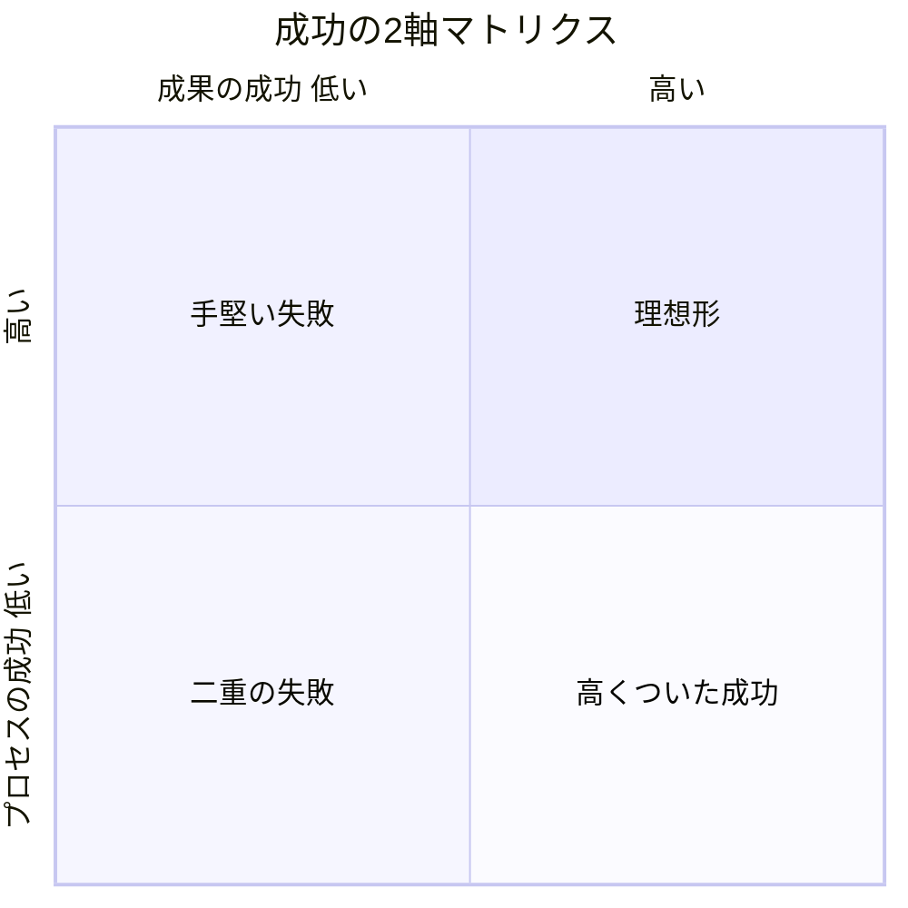
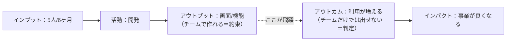

# 統合ツール：プロジェクト成功の評価

> 統合元：PMBOK 第8版「成果の成功／プロセスの成功」の二軸（[../standard/05_success_criteria.md](../standard/05_success_criteria.md)）
> ＋ 内製教科書 第11章「アウトプットとアウトカム」。
> **残した中心**：PMBOKの二軸マトリクスを骨格に、教科書の「ベースライン／前提検証／確認日をカレンダーに」を実装手順として組み込む。

## 1. 二軸（PMBOK：これを骨格に採用）

| 軸 | 問い | 指標 |
|----|------|------|
| 成果の成功（有効性 / アウトカム） | 作ったものは価値を生んだか | 利用率・KPI・課題解決度・顧客満足 |
| プロセスの成功（効率性） | 無駄なく持続可能に作れたか | QCD順守・チーム健全性・リスク対応 |

- ③「予定通り作ったが誰も使わない」＝**内製組織の“静かな失敗”**（教科書 第38章・型I）。
- PMは「成果はチームだけでは出せない」（アウトカムは店員の動きや顧客の認知に依存）を前提に、
  **約束はアウトプットで、判定はアウトカムで**行う（二回報告する前提で計画に組み込む）。

## 2. アウトプット/アウトカムの言い換え（教科書：これを実装に採用）

> 約束はアウトプットで、判定はアウトカムで（二回報告する前提で計画）。

| よくある書き方（アウトプット） | 直した形（アウトカム） |
|---|---|
| 機能をリリースする | その機能を使った行動が一定割合に達する |
| 20店舗に展開する | 展開した店舗で実際に業務が回っている |

## 3. 測れる状態を作る（リリース前にしかできない）

| 準備 | いつ | 抜けると |
|---|---|---|
| ベースライン | 開発初期〜リリース1ヶ月前 | 「増えた」と言えるが「いくつから」が言えない |
| 計測の仕組み | 要件定義（実装はリリースと同時） | リリース後に足すと過去データが永久に取れない |
| 判定の基準 | 立ち上げ時 | 数字を見ても良し悪しを誰も判断できない |
| 確認の日 | リリース日にカレンダー登録（4週・8週・12週後） | 誰も見ない（＝静かな失敗の完成） |

測れないアウトカムは**代理指標**を決める（絶対値の正しさより、前後を同じ物差しで比較できること）。

## 4. レビューへの組み込み
1. マイルストーンごとに二軸を分けて評価（1つの進捗率に混ぜない）。
2. 成果の成功は事業側・利用者を交えて評価。
3. アウトカム確認は担当者の評価に直結させない（直結すると良い数字だけが報告される：教科書 第37章・第39章）。
