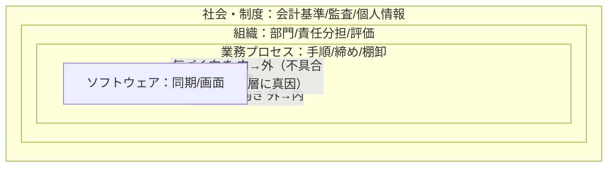

# 実践01：内製チームPMの立ち位置（第1部）

出典：『プロジェクトマネジメントの教科書（内製チーム向け）』第1〜6章。PMBOK標準（`../standard/`）を、
**発注者と受注者の境界がない内製組織**でどう使うかの実践層。

## 内製の「静かな失敗」
受託の失敗は派手（納期・予算の破綻）。**内製の失敗は静か**＝予定通りリリース・予算内、それでも誰も使わない／機能が増え全体を把握する人が消える。失敗と認識されないので繰り返す。→ [../merged/success_evaluation.md](../merged/success_evaluation.md)

三つの立場：①計画は外れる前提（価値は当たることでなく**ずれの検出**）②要件を軽く扱わない③言われていないことを扱う。

## 第1章 システムは道具
- **社会技術システム**：動くのはソフト単体でなく、業務手順・組織・制度を含む全体（4層：社会制度＞組織＞業務プロセス＞ソフトウェア。外側は内側の都合では変えられない）。
- **SoR（記録／正確・決めてから作る）／SoE（関わり／使いやすさ・作ってから決める）**は機能単位。判断軸＝間違えたとき何が起きるか（戻せない＝SoR／作り直せる＝SoE）。



## 第2章 プロジェクトとプロダクト
プロジェクトは終わる／プロダクトは続く。内製PMには**終わらせる・育て続ける・選択する（捨てる）**の三技術。ディスカバリーとデリバリーは並走。

```mermaid
flowchart LR
  PJ["プロジェクト（有期）"] --> REL["リリース＝ここで解散"]
  REL --> PD["プロダクト（継続）＝ここから本当の人生<br/>運用・改修・いつか廃棄"]
  PD --> T["三つの技術：終わらせる／育て続ける／選択する（捨てる）<br/>多くの組織は一つ目しか持たない→負債が積み上がる"]
```mermaid
flowchart TB
  D["工期"]
  B["予算"]
  Q["品質"]
  S["スコープ"]
  D --- B
  D --- Q
  B --- S
  Q --- S
  B -. 一つ固定すれば他が動く .- Q
```

> **トレードオフスライダー（同率禁止・圧力前に合意）**：1位 データの正しさ ＞ 2位 期日 ＞ 3位 スコープ ＞ 4位 画面の作り込み。苦しいときは下位から落とす。内製では予算より「人の時間」が硬い制約。
        工期
       ╱   ╲
   予算─────品質      一つ固定すれば他が動く。
       ╲   ╱          「全部固定」は算数として不成立。
      スコープ         内製では予算より「人の時間」が硬い。
──────────────────────────────────────────────
トレードオフスライダー（同率禁止・圧力前に合意）
1位 データの正しさ ●───────────
2位 期日           ─●──────────
3位 スコープ       ────●────────  ← 苦しいとき落とすのは下位から
4位 画面の作り込み ──────────●──
```
