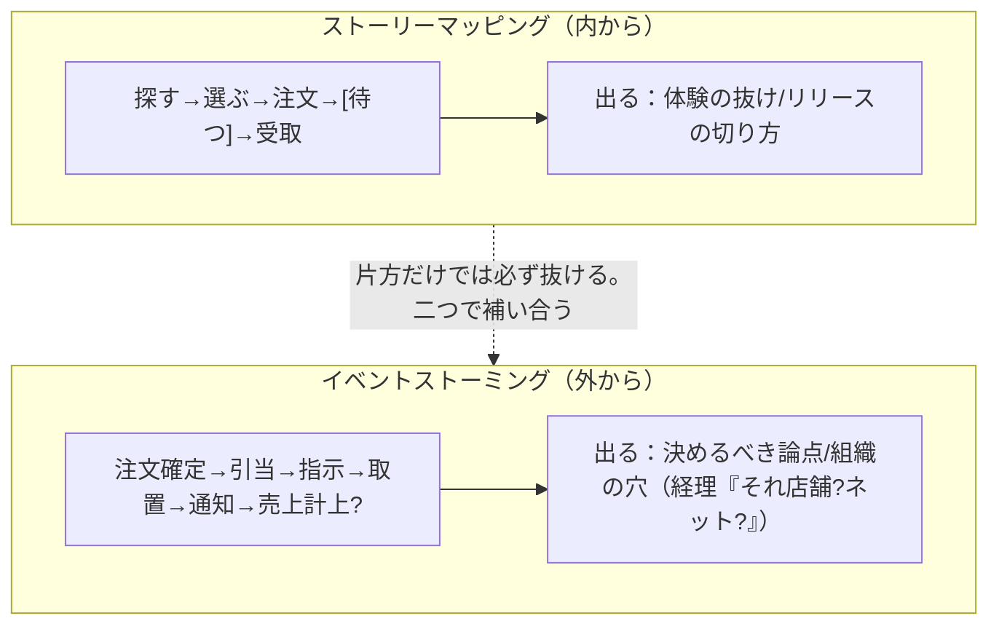
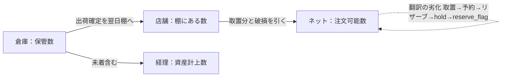

# 実践02：何を作るか決める・見えないものを見つける（第2〜4部）

本書の中心。「スケジュールを引く技術より、作るべきものを見誤らない技術」。

## 第2部 業務と戦略（第7〜13章）
- **第7章 業務**＝繰り返される活動。「書けない部分は理解していない部分」。**スイムレーン**で隠れた関係者（経理）とレーン間で落ちる受け渡しが見える。

```mermaid
flowchart LR
  subgraph C["お客様"]
    C1["選ぶ"] --> C2["来店"]
  end
  subgraph SYS["システム"]
    S1["在庫確保"] --> S2["通知/照合材料"]
  end
  subgraph ST["店員"]
    T1["取る→取置"] --> T2["受渡"]
  end
  subgraph AC["経理 ★このレーンが増える"]
    A1["売上受取"]
  end
  C1 --> S1 --> T1 --> S2 --> C2 --> T2 --> A1
```mermaid
flowchart LR
  W["Why：店舗を活かし客を取り戻す"]
  W --> H1["見込み客：受取店舗を選ぶ"] --> S1["在庫統合/予約画面（システム）"]
  W --> H2["店員：通知で棚から取る"] --> S2["通知/作業画面（システム＋運用）"]
  W --> H3["店長：自店成果と歓迎"] --> S3["売上計上ルール（★システム外）"]
```
> Whoを社内まで広げると「止める最大要因がシステムの外」と分かる。
Why(ゴール)    Who(誰が)   How(行動変化)      What(打ち手)     ｼｽﾃﾑか
店舗を活かし ┬ 見込み客 ── 受取店舗を選ぶ ── 在庫統合/予約画面  ○
客を取戻す   ├ 店員     ── 通知で棚から取る ─ 通知/作業画面      △運用も
             └ 店長     ── 自店成果と歓迎 ── 売上計上ルール     ✕システム外
   Whoを社内まで広げると「止める最大要因がシステムの外」と分かる。
```
- **第11章 アウトカム**：作ったものと起きた変化は別。→ [../merged/success_evaluation.md](../merged/success_evaluation.md)
- **第12章 プロダクトビジョン**：ビジョンは**断るための道具**。JTBDで要望をジョブに戻す。
- **第13章 Why-Howラダー**：なぜ？で上がりどうやって？で降りる。議論が噛み合わない原因は抽象度のずれ。

## 第3部 何を作るか決める（第14〜19章）
- **第14章 境界**：規則性・頻度・変化の速さで線を引く。人側に置いた手順にも要件（記録・照合材料・運用手順）。境界を動かすとコストは消えず移る。
- **第15章 要件の種類**：業務/システム/機能/**非機能**を混ぜない。非機能の不足は「動かない」でなく**現場が運用で回避する**形で現れる。ログは後付け不可。
- **第16章 可視化**：ユーザーストーリーマッピング（内から＝体験の抜け）＋イベントストーミング（外から＝組織横断の認識ずれ）。片方だけでは必ず抜ける。


- **第17章 構造化**：目的/業務/システム/機能の層に分け、下→上（根拠なき機能）と上→下（抜け）の双方向検査。RDRA。
- **第18章 書く・受入条件**：「適切に」は未決を隠す語。**Given-When-Then**は例外を書き出させる（正常系1本・例外4本以上）。完了の定義（DoD）。

| # | Given | When | Then |
|---|---|---|---|
| ① 正常系 | 在庫2個 | 注文確定 | 1減り取置 |
| ② | 在庫0 | 一覧を開く | 選択不可/近い順に他店 |
| ③ | 残1で同時 | 2人が確定 | 先の1件成立/後は選び直し |
| ④ | 現物なし | 記録 | 実数補正/取消待ち |
| ⑤ | 期限超過 | 開店前 | 在庫解放/取消 |

> 正常系1本に対し、例外は4本以上。機能一覧を眺めても出てこない。
- **第19章 スコープと優先順位**：要件は必ず溢れる。MoSCoW（Must半分超は失敗）・狩野モデル。手法より先に揃える＝上位判断・粒度・損失・コスト概算。落とした要件は理由と再検討条件を記録。

| MoSCoW | 狩野モデル | 落とすと何が起きるか |
|---|---|---|
| Must（必須） | 当たり前品質 | 無いと不満・要望に出ない → 落とすと致命傷 |
| Should（重要） | 一元的品質 | あるほど満足 → 段階的に上げる |
| Could（あれば） | 魅力的品質 | 無くても不満なし → 落としても平気 |
| Won't（今回無し） | — | ★当たり前品質は要望に出ず表に載らない |

> Mustが半分超なら分類は失敗（並べる前と情報量が同じ）。

## 第4部 見えないものを見つける（第20〜24章）
**要件は語られたことの中にはない。**
- **第20章 MECE**：抜けは注意力でなく「やり方」で見つける。複数の軸で切り直す。MECEの限界＝気づいていない要素と相互作用には効かない。
- **第21章 当たり前すぎて言わない**：氷山モデル（語られること/手順/判断基準/価値観）。横で見る・やってみる・逆に説明する・新人に聞く。質問は抽象化させず具体的出来事を想起させる。

```mermaid
flowchart TB
  A["語られること：『商品を取って置く』<br/>（聞けば出る）"]
  B["語られない手順：入荷箱を確認/古い物を片付ける<br/>（見れば出る）"]
  C["判断基準：冷蔵は別/高額は鍵付き<br/>（なぜ今?で出る）"]
  D["価値観：客を待たせない＞在庫正確<br/>（ほぼ出ない・観察で推測）"]
  A --> B --> C --> D
  D -.->|下ほど効くのに下ほど聞いても出ない| A
```mermaid
quadrantChart
    title クネビン（領域を取り違えると対処が逆効果）
    x-axis 因果が不明確 --> 因果が明確
    y-axis 静的 --> 動的
    quadrant-1 Complicated（感知→分析→対応）
    quadrant-2 Complex（探索→感知→対応）
    quadrant-3 Chaotic（行動→感知→対応）
    quadrant-4 Clear（感知→分類→対応）
```
> Simple×数量＝Complicated（分かる）／Simple×相互作用＝Complex（事後にしか分からない）。1つのPJに複数領域が同居。Complexに詳細計画＝最頻の誤り→撤退条件つき小試行で。
Simple×数量     = Complicated （専門知識と時間で分かる／足し算）
Simple×相互作用 = Complex     （事後にしか分からない／掛け算）

クネビン：  Complex   │ Complicated
           探索→感知→対応│ 感知→分析→対応   ← 領域を取り違えると対処が逆効果
          ─────────────┼─────────────
           Chaotic    │ Clear
           行動→感知→対応│ 感知→分類→対応
1つのPJに複数領域が同居。Complexに詳細計画=最頻の誤り→撤退条件つき小試行で。

> 矢印（変換規則）にラベルを書けない所で数が合わなくなる。ユビキタス言語＝会議・コード・画面で同じ語を使う。
同じ「在庫」が部署で別の数（コンテキストマップ）
 [店舗]棚にある数 ─変換:取置分と破損を引く→ [ネット]注文可能数
 [倉庫]保管数    ─変換:出荷確定を翌日棚へ→ [経理]資産計上数(未着含む)
   ★矢印(変換規則)にラベルを書けない所で、システムの数が合わなくなる。
翻訳の劣化：取置→予約→リザーブ→hold→reserve_flag（4回訳して意味がずれる）
   → ユビキタス言語＝会議・コード・画面で同じ語を使う。
```
