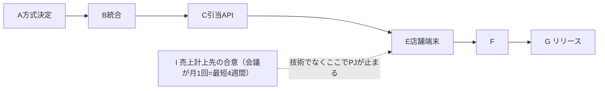
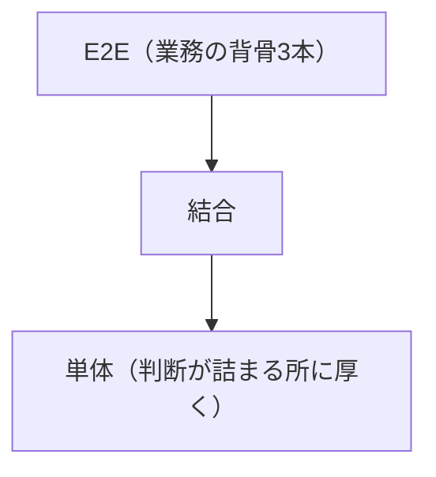

# 実践03：計画する（第5部・第25〜28章）

「外れる前提で立てる」の実践編。

## 第25章 見積り
予言でなく不確実性の表明。三点見積り、**幅は伝わる過程で必ず一点に潰される**ので潰す位置と記録をこちらで設計。参照クラス予測。→ [../merged/estimation_evm.md](../merged/estimation_evm.md)

```mermaid
xychart-beta
  title "不確実性コーン（時間でなく分かったときだけ狭まる）"
  x-axis [企画, 要件, 設計, 実装]
  y-axis "実績比" 0 --> 4
  line [4, 2, 1.3, 1]
  line [0.25, 0.5, 0.8, 1]
```


> 各段で確実性が上がり日付になる。潰す位置（悲観寄り）と記録を自分で設計。

## 第26章 スケジュールと計画
計画は守るものでなく**更新するもの**（ずれに気づくため）。**クリティカルパスは合意もノード**として置く。内製では人数を工数換算した時点で3〜4割の嘘（兼任・割り込み）→実効稼働で計画。バッファは個人でなく**CCPM**で見える所に集約。**ローリングウェーブ**（遠くは粗く、詳細化する作業自体を予定に置く）。マイルストーンは「まだです」と言えるかで質が決まる。



| バッファ消費 | 20% | 40% | 60% | 80% |
|---|---|---|---|---|
| 工程進捗 | 40% | 40% | 40% | 40% |
| 見方 | 余裕 | 想定 | 警告 | 今スコープを削る |

> 60%で会話を始めれば削る時間がある。

**ローリングウェーブ**（近くは細かく・遠くは粗く／詳細化する作業自体を予定に置く）
```mermaid
flowchart LR
  N["直近2週間：作業レベル（日単位）"] --> M["1〜3ヶ月：機能レベル"] --> F["3ヶ月以降：テーマレベル（根拠なき日付を書かない）"]
```mermaid
flowchart LR
  R1["要件定義"] === U["受入テスト(UAT)"]
  R2["基本設計"] === SY["システムテスト"]
  R3["詳細設計"] === IT["結合テスト"]
  R4["実装"] === UT["単体テスト"]
```


> V字は順序でなく「決めた時点で検証も決まる」対応表。逆ピラミッド（E2E過多）は壊れやすく形骸化。
V字モデル（順序でなく「決めた時点で検証も決まる」対応表）
 要件定義 ●━━━━━━━━━━━━● 受入ﾃｽﾄ(UAT) ← 受入条件がそのままシナリオ
   基本設計 ●━━━━━━● ｼｽﾃﾑﾃｽﾄ
     詳細設計 ●━━● 結合ﾃｽﾄ
       実装 ●● 単体ﾃｽﾄ

テストピラミッド            逆ピラミッド(E2E過多)
        △ E2E(業務の背骨3本)  → 壊れやすく遅く、誰も信頼しなくなり形骸化
      ╱結合╲
    ╱ 単体  ╲ ←判断が詰まる所に厚く
```
