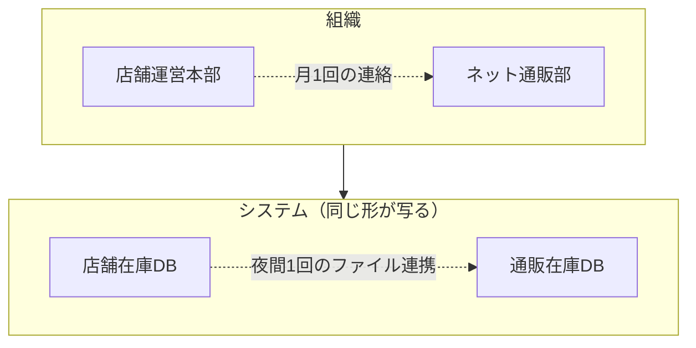
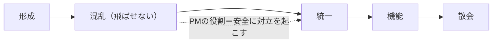
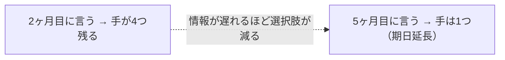

# 実践04：人と関係者（第6部・第29〜33章）

「正しい計画を立てたのに進まない」を人と関係の側から診断する。

## 第29章 組織設計と会議体
PJが止まる主因は技術でなく**判断が下りてこない**こと。RACI／DACI、会議は「決めないこと」も明示して設計、報告だけの会議は不要。**コンウェイの法則**（組織の連絡形がシステムの形になる／逆コンウェイ）、チームトポロジー、認知負荷。→ [../merged/raci_daci.md](../merged/raci_daci.md)

> 帯域が「月1」なら連携も「1日1回」。逆コンウェイ：望むシステム構造から組織を編成する。

## 第30章 チームを機能させる
**ブルックスの法則**（遅れてから人を足すとさらに遅れる／スコープ調整が効く）。タックマンの混乱期は飛ばせない。**心理的安全性は仲の良さでなく悪い情報の流通速度を決めるもの**。上がってきた遅れに何も応えないと次から上がってこない。WIP制限、割り込みは分散でなく集めて隔離。バス係数（致命的な単一障害点だけ二人目を作る）。

| | 仲が良いだけ | 心理的安全性が高い |
|---|---|---|
| 反対意見 | 言わない | 課題になら言う |
| 遅れ | 粘る | 早く出す |
| ミス | 一人で直す | 事実で報告 |

> 反論が一度も出ない会議が続くなら「安全」でなく「黙っている」。

## 第31章 ステークホルダー
権力×関心×**態度**のキューブ。権力高・関心低を放置すると終盤で覆される。態度は変わる（評価に触れる論点で）。→ [../merged/stakeholder.md](../merged/stakeholder.md)

## 第32章 コミュニケーションと透明性
透明性はモラルでなく効率。悪い知らせほど早く。報告は事実・解釈・要求の三点セット＋「判断しないコスト」。情報ラジエーター（詰問の材料にすると見えなくなる）。→ [../merged/communication.md](../merged/communication.md)

> **報告の三点セット**：結論（同期が期日リスク）→ 事実（夜間4h/要2h）→ 解釈（方式変更2週 or 10店に絞る）→ 要求（金曜まで/決めねば1週間遅れ）。「判断しないコスト」を書くのが効く。最初の一言は「早く分かってよかった」に固定。

## 第33章 合意形成とそれが崩れるとき
合意は取るものでなく**維持するもの**。崩れる6つの型（担当交代/上位方針/認識ずれ/欠席者出現/事実による否定/そもそも合意せず）。**沈黙は合意でない**。コンセンサスよりコンセント、Disagree and Commit。**ADR**（最重要は「選ばなかった代替案と理由」）。記録は相手を黙らせるためには使わない。

| 型 | PMが防げるか | 対応 |
|---|---|---|
| 1 担当交代 | 防げない | 記録で速く立て直す |
| 2 上位方針 | 防げない | 前提を明示「変わったら見直す」 |
| 3 認識ずれ | 防げる | 具体物/画面で確認 |
| 4 欠席者出現 | 防げる | 権力高・関心低を先に押さえる |
| 5 事実で否定 | 一部 | 不確実は先に試す |
| 6 そもそも未合意 | 防げる | 名指しで確認（沈黙を数えない） |
