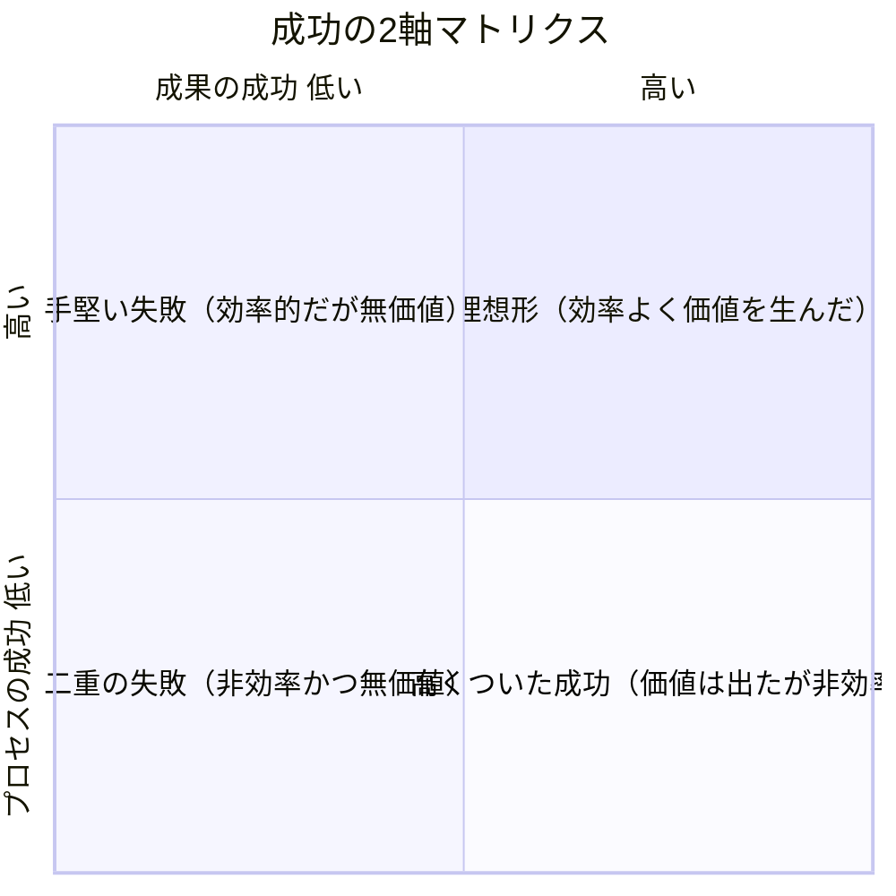
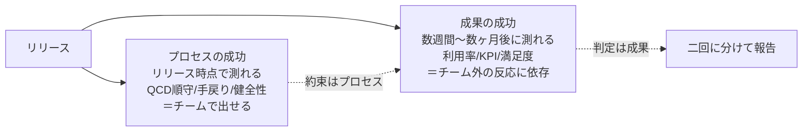

# 5. プロジェクト成功の評価軸：成果の成功／プロセスの成功

第8版では、プロジェクトの成功を単一の指標（納期・予算順守など）ではなく、
**成果の成功（Outcome Success／有効性）** と **プロセスの成功（Process Success／効率性）**
の **二軸** で評価する考え方が重視される。

## 5.1 二軸の定義

| 軸 | 別名 | 問い | 典型的な指標 |
|----|------|------|--------------|
| 成果の成功（有効性） | Effectiveness | 「作ったものは価値を生んだか？」 | ビジネス成果（売上・利用率・顧客満足度・課題解決度） |
| プロセスの成功（効率性） | Efficiency | 「無駄なく・持続可能に作れたか？」 | QCD順守（品質・コスト・納期）、チームの健全性、リスク対応の的確さ |

> 重要：**この2軸は独立している**。片方が高くても、もう片方は低い場合がある。
> 「予定通り・予算内で作ったが誰も使わない」＝プロセス成功・成果失敗。
> 「大幅な予算超過だったが事業を救った」＝成果成功・プロセス失敗。
> どちらの評価も一面的であり、両方を見ることが第8版の要求。

## 5.2 2軸マトリクスで振り返る

| 象限 | 状態 | 典型パターン | 次にとるべきアクション |
|------|------|-------------|----------------------|
| ① 理想形 | 効率よく価値を生んだ | 順調な成功事例 | 再現性を確立し、社内標準プロセスとして共有 |
| ② 高くついた成功 | 価値は生んだが非効率だった | 火消し・突発対応で乗り切った | 何が非効率だったかを分解し、次回のプロセス改善に反映 |
| ③ 手堅い失敗 | 効率的に進めたが価値を生まなかった | 計画通り完了、しかし需要が消失していた等 | 「原則2：価値に注力する」の検証タイミングが遅すぎた可能性を検討 |
| ④ 二重の失敗 | 非効率かつ無価値 | 早期に軌道修正すべきだったプロジェクト | プロジェクト継続の是非そのものを再検討（Go/No-Goの再評価） |

## 5.3 指標設計の例

### 成果の成功（有効性）の指標例
- 主要KPIの達成度（例：CVR改善率、解約率低下、処理時間短縮）
- リリース後Nヶ月時点の利用継続率・満足度調査結果
- ステークホルダーが「これは成功だった」と自発的に評価するか（定性評価）

### プロセスの成功（効率性）の指標例
- 計画対比のスケジュール差異（SV/SPI）・コスト差異（CV/CPI）
- 重大な品質不具合の件数・手戻り率
- チームの残業時間・離脱率・エンゲージメント調査結果
- リスクが顕在化した際の対応リードタイム

**図：2軸は測る時点も指標も違う**

## 5.4 レビューへの組み込み方

1. **マイルストーン／フェーズゲートごとに、二軸を分けて評価する**
   （1つの「進捗率」に混ぜて表現しない）
2. **成果の成功は、PM単独ではなく事業側・エンドユーザー側を交えて評価する**
   （[原則2：価値に注力する](02_six_principles.md)の「複数視点」を体現する場にする）
3. **プロセスの成功は、チームの持続可能性（[原則5](02_six_principles.md)）まで含めて評価する**
   （QCDだけでなく、チームが疲弊していないかを含める）

## 5.5 演習：直近プロジェクトを二軸で採点する

| 評価項目 | 点数（1〜5） | 根拠（一言） |
|---------|-------------|-------------|
| 成果の成功：KPI達成度 | | |
| 成果の成功：ステークホルダー評価 | | |
| プロセスの成功：QCD順守 | | |
| プロセスの成功：チームの健全性 | | |

- 4項目の平均から、5.2の2軸マトリクスでどの象限に位置するかをプロットする
- ③④に該当した場合は、原因を[02の6原則](02_six_principles.md)のどれに
  紐づけられるか議論する（[07_training_curriculum.md](../training_curriculum.md) Week6で実施）
