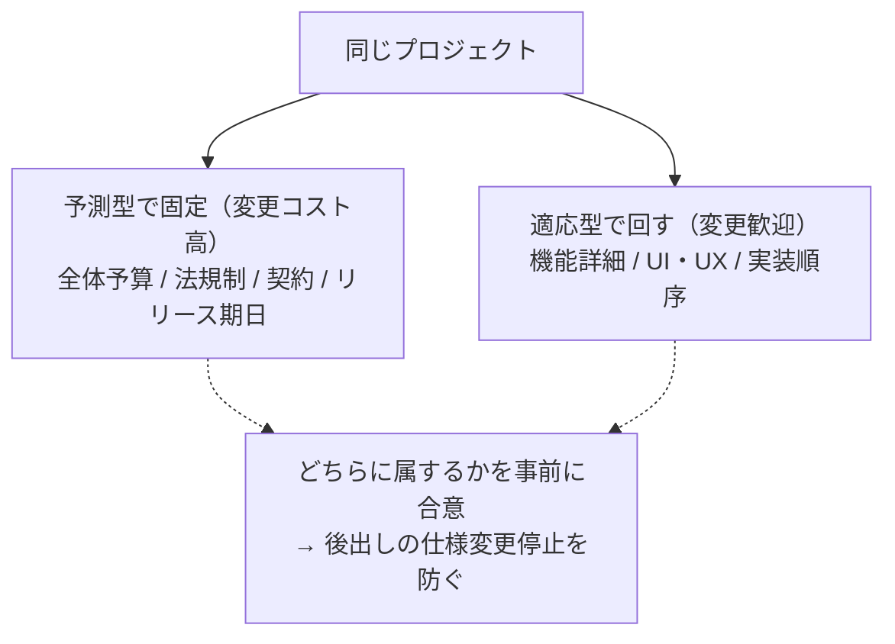

# 8. アジャイル／ハイブリッドとの橋渡し

PMBOKは特定の開発アプローチ（予測型／適応型／ハイブリッド）を強制しない
「フレームワーク」であり、[原則1（ホリスティックな視点）](02_six_principles.md)と
テーラリングの考え方に基づき、プロジェクト特性に応じて選択する。
本ファイルは、Scrum等の適応型実務者がPMBOKの概念とどう対応づけて理解すればよいかを橋渡しする。

> ⚠️ 本ファイルは学習用の対応関係整理であり、公式ガイドがこの粒度で
> 対応表を明示しているわけではない。概念の理解を助けるための独自整理として扱うこと。

## 8.1 開発アプローチの3類型

| アプローチ | 特徴 | 向いているプロジェクト |
|-----------|------|------------------------|
| 予測型（Predictive／Waterfall的） | 要件を先に確定し、計画通りに進める | 要件が安定・規制対応が厳しい・大規模インフラ等 |
| 適応型（Adaptive／Agile） | 短いサイクルで作り、フィードバックで方向修正する | 要件が変化しやすい・市場検証が必要なプロダクト開発等 |
| ハイブリッド | 一部は予測型（例：全体予算・法規制対応）、一部は適応型（例：機能開発）で進める | 多くの実プロジェクトの実態はこちら |

**図：アプローチは点でなくスペクトラム**

**図：ハイブリッドは「1プロジェクトの中で線を引く」**

## 8.2 PMBOKプロセス／原則 と Scrumセレモニーの対応（学習用整理）

| PMBOKの概念 | 対応するScrum実務 | 対応関係の性質 |
|-------------|--------------------|-----------------|
| プロジェクトマネジメント計画書作成（[04](04_process_reference.md)） | プロダクトバックログ＋リリース計画 | 「計画」を1回で確定するか、継続更新するかの違い |
| スケジュールのコントロール（[04](04_process_reference.md)） | バーンダウンチャート＋スプリントレビュー | 進捗の可視化手段が異なるだけで目的は同じ |
| 統合変更管理の実行（[04](04_process_reference.md)） | プロダクトバックログのリファインメント | 変更を「承認手続き」で扱うか「継続的な優先順位付け」で扱うかの違い |
| リスクの監視（[04](04_process_reference.md)） | デイリースクラムでの障害共有 | 頻度が違うだけで、早期検知という目的は共通 |
| 原則2：価値に注力する（[02](02_six_principles.md)） | スプリントレビューでの検査・適応（Inspect & Adapt） | ほぼ同義。Scrumの中核思想そのもの |
| 原則6：権限付与された文化（[02](02_six_principles.md)） | レトロスペクティブでの率直な振り返り | ほぼ同義 |
| 5.4 レビューへの組み込み方（[05](05_success_criteria.md)） | スプリントレビュー（成果）＋レトロスペクティブ（プロセス） | 二軸評価がそのままScrumの2つの会議に対応 |

**要点**：Scrum実務者にとって、PMBOK第8版は「別の方法論」ではなく
**すでにやっていることに共通言語のラベルを貼る作業**に近い。特に
原則2（価値）・原則6（文化）はScrumの思想とほぼ重なる。

## 8.3 ハイブリッドプロジェクトでの実務指針

1. **予測型で固定すべき領域**（変更コストが高いもの）を先に決める
   - 例：全体予算の上限、法規制・コンプライアンス要件、外部ベンダーとの契約条件
2. **適応型で進める領域**（変更歓迎な部分）を明示する
   - 例：機能の詳細仕様、UI/UX、内部の実装順序
3. どちらの領域に属するかをステークホルダーと**事前に合意**しておく
   （合意がないと「なぜ今さら仕様変更を止めるのか」で揉める）
4. [10_templates.md](../merged/README.md) のコミュニケーション計画は、予測型領域は
   フォーマルな報告、適応型領域はスプリントレビュー等の軽量な共有、と
   使い分けると運用しやすい

## 8.4 演習：自分のプロジェクトのアプローチ診断

| 領域 | 予測型/適応型どちらが向くか | 理由 |
|------|------------------------------|------|
| 全体予算 | | |
| スケジュールの大枠 | | |
| 機能仕様の詳細 | | |
| UI/UX | | |
| 外部ベンダーとの契約 | | |

すべて「予測型」に寄っている場合は、変化への対応力（[原則5：持続可能性](02_six_principles.md)）
が犠牲になっていないかを疑う。すべて「適応型」に寄っている場合は、
予算・契約などステークホルダーとの約束事が曖昧になっていないかを疑う。
